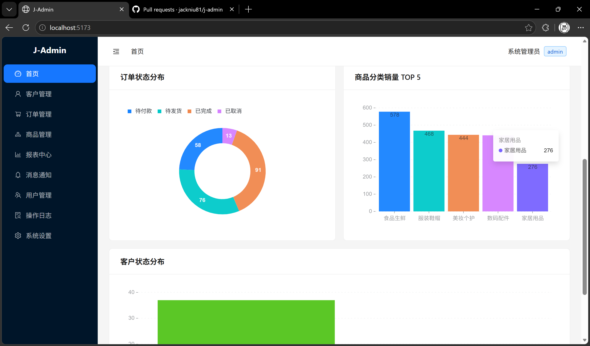

# J-Admin

轻量全栈业务管理后台模板 —— **NestJS + React + Ant Design**，单仓 npm workspaces，一条命令同时起前后端。

- **双数据源一键切换**：默认文件数据库（免安装，开箱即用），配置 `DB_DRIVER=postgres` 即切 PostgreSQL
- **认证与鉴权**：JWT + 全局 Guard + `@Roles` RBAC，路由守卫与后端二次校验双保险
- **后台高频 CRUD**：ProTable 列表（搜索 / 筛选 / 排序 / 分页）+ ModalForm 表单 + 软删除二次确认
- **Dashboard 看板与报表中心**：统计卡片 + 折线 / 饼 / 柱状图（@ant-design/plots），时间维度 7/14/30 天切换
- **图片上传基座**：本地磁盘存储（multer，按月归档 + uuid 命名），可平滑替换为 OSS，接口契约不变
- **统一约定**：后端全局响应体 `{ code, data, message }` + 全局异常过滤 + 分类业务错误码



> 界面截图与逐页操作说明见 **[使用手册 docs/user-guide.md](./docs/user-guide.md)**。

## 技术栈

| 层次 | 选型 | 版本 |
| --- | --- | --- |
| 语言 / 运行时 | TypeScript + Node.js | TS 5.7 / Node 20+ |
| 仓库管理 | npm workspaces + concurrently | — |
| 后端框架 | NestJS（Express 适配器，全局前缀 `/api`） | 12 |
| 鉴权 | @nestjs/jwt + 自写 JwtAuthGuard / RolesGuard + RBAC 装饰器 | 12 |
| 参数校验 | class-validator + class-transformer（全局 ValidationPipe） | 0.15 / 0.5 |
| 密码哈希 | bcryptjs | 3 |
| 数据访问 | 自研 `DataStore` 抽象（FileStore / PostgresStore 双实现，无 ORM） | — |
| 数据库 | 文件数据库（默认）/ PostgreSQL（`pg` 驱动）按配置切换 | pg 8 |
| 文件上传 | @nestjs/platform-express + multer（本地磁盘基座） | 2 |
| 前端框架 | React | 19 |
| 构建工具 | Vite（dev 代理 `/api` → 3000） | 8 |
| 路由 / 请求 | React Router / axios（同源相对 `/api`） | 8 / 1.2 |
| UI | Ant Design 5 + @ant-design/pro-components（ProTable / ProForm） | 5.29 / 2.8 |
| 图表 | @ant-design/plots | 2.6 |
| 部署 | 单进程 Node（Nest 托管前端静态 + SPA fallback），Docker 待补 | — |

## 快速开始

### 环境要求

Node.js 20+，npm 9+（workspaces）。

### 1. 安装依赖

```bash
npm install
```

### 2. 配置（可选）

默认 **file 模式零配置即可启动**。需要自定义时复制示例文件按需修改：

```bash
cp server/.env.example server/.env
```

全部可用变量见 [server/.env.example](./server/.env.example)，数据源相关说明见下文 [数据库配置](#数据库配置)。

### 3. 启动开发

```bash
npm run dev
```

`concurrently` 同时拉起后端（http://localhost:3000 ，`/api`）与前端（http://localhost:5173 ，Vite 代理 `/api`）。首次以 file 模式启动会自动生成种子数据。

演示账号：

| 账号 | 密码 | 角色 |
| --- | --- | --- |
| `admin` | `admin` | 管理员（可见用户管理） |
| `user2` | `user2` | 普通用户 |
| `user3` | `user3` | 普通用户 |

### 4. 生产构建与运行

```bash
npm run build   # 先 client 后 server
npm start       # node server/dist/main.js
```

生产期由 NestJS 单进程托管 `client/dist` 静态资源并做 SPA fallback，同源 `/api`，无需 nginx。

## 数据库配置

数据源由唯一开关 `DB_DRIVER` 决定（`file` | `postgres`），二者共用同一套 `DataStore` 接口与业务代码。

### 文件模式（默认）

```bash
DB_DRIVER=file
DB_FILE=./data/db.json   # 相对 server 工作目录，即 server/data/db.json
```

整份 JSON 常驻内存、写操作先 `.tmp` 再 `rename` 原子落盘，免安装、适合本地演示。重置种子数据：

```bash
npm run seed -w server
```

### PostgreSQL 模式

**① 建库**（迁移只建表，不建库，需先手动建库）：

```sql
CREATE DATABASE j_admin;
```

**② 配置 `server/.env`**：

```bash
DB_DRIVER=postgres
PG_HOST=localhost
PG_PORT=5432
PG_USER=postgres
PG_PASSWORD=your_password   # postgres 模式下必填，缺失则启动即报错
PG_DATABASE=j_admin
```

**③ 初始化表结构**（三选一）：

| 方式 | 命令 | 说明 |
| --- | --- | --- |
| 自动迁移（推荐） | 直接 `npm run dev` / `npm start` | `DB_DRIVER=postgres` 时 `PostgresStore.init()` 启动即应用未执行的迁移 |
| 手动迁移 | `npm run db:migrate -w server` | 读 `server/.env` 的 PG 配置，应用后退出 |
| 纯 SQL 脚本 | `psql -d j_admin -f docs/sql/postgres-schema.sql` | 无 Node 环境时给 DBA / psql 用；`npm run db:sql -w server` 可重新生成 |

迁移定义在 `server/src/data/migrations/`（`0001` 建表、`0002` 部分唯一索引 + 查询索引、`0003` orders/products 建表建索引），forward-only，记录于 `schema_migrations` 表。

**④ 灌入种子数据**：

```bash
npm run seed -w server
```

> 本地未安装 PostgreSQL 时，保持默认 `DB_DRIVER=file` 即可，全部功能一致。

## 功能与界面

侧边栏 9 个菜单，M1 P0（登录 + 布局 + 数据表格）、M2 P1（Dashboard + 表单）、M3 P2（通用能力）已全部落地；M4 的订单 / 商品 / 报表三个业务页已实现。

| 模块 | 状态 | 说明 |
| --- | --- | --- |
| 登录 / 路由守卫 | ✅ 已实现 | JWT、token 过期跳登录、角色过滤 |
| 首页 Dashboard | ✅ 已实现 | 统计卡片 + 趋势/状态/分类图表，数据全部来自服务端真实口径 |
| 客户管理 | ✅ 已实现 | 列表/搜索/筛选/排序/新增/编辑/软删除 |
| 订单管理 | ✅ 已实现 | 主从结构（明细行）+ 状态机流转 + 日期区间筛选 + 金额后端重算防篡改 |
| 商品管理 | ✅ 已实现 | CRUD + 上下架 + 图片上传回显 + 缩略图预览 |
| 报表中心 | ✅ 已实现 | 销售额/订单数/客单价/取消率 + 趋势/状态分布/分类 TOP5，空数据自动 mock |
| 图片上传 | ✅ 已实现 | 本地磁盘基座（2MB / 类型白名单），可替换 OSS |
| 用户管理 | ✅ 已实现（仅 admin） | 列表/新建/启用禁用/删除 |
| 消息通知 / 操作日志 / 系统设置 | 🚧 占位页 | 点击进入「功能开发中」 |

各页截图与操作细节见 **[docs/user-guide.md](./docs/user-guide.md)**。

## 项目结构

```
.
├── client/            # React + Vite 前端
│   └── src/{api,auth,components,pages,routes.tsx}
├── server/            # NestJS 后端
│   ├── src/
│   │   ├── config/    # 环境变量校验与类型化读取
│   │   ├── data/      # DataStore 抽象 + FileStore/PostgresStore + 迁移 + seed
│   │   ├── common/    # 全局响应拦截、异常过滤、JWT Guard、RBAC
│   │   └── {auth,customers,users,orders,products,reports,upload,dashboard}/  # 业务模块
│   ├── uploads/     # 图片上传落盘目录（按月归档，不入 git）
│   └── .env.example   # 环境变量示例
└── docs/              # 文档：README 索引 / spec / issues / user-guide / sql + 截图
```

## 常用脚本

| 命令 | 作用 |
| --- | --- |
| `npm run dev` | 同时启动前后端（开发） |
| `npm run build` | 构建 client + server |
| `npm start` | 生产运行（Nest 托管前端） |
| `npm run seed -w server` | 重置种子数据 |
| `npm run db:migrate -w server` | 应用 PostgreSQL 迁移 |
| `npm run db:sql -w server` | 打印等价 PG SQL 脚本 |

## 文档

完整索引见 **[docs/README.md](./docs/README.md)**（文档目录首页）。

- **[docs/user-guide.md](./docs/user-guide.md)** —— 使用手册：按界面逐项介绍，含截图与角色权限矩阵
- [docs/spec.md](./docs/spec.md) —— 功能规格：架构约定、双数据源方案、统一响应与错误码、RBAC 权限矩阵、API 契约、验收标准
- [docs/issues.md](./docs/issues.md) —— Issue 与 Milestone 规划 + 下一步（M5）优先级
- [docs/sql/postgres-schema.sql](./docs/sql/postgres-schema.sql) —— PostgreSQL 初始化脚本（由 `npm run db:sql -w server` 生成）

## 当前进度与下一步

**已完成**（M1 P0 + M2 P1 + M3 P2 全部；M4 进行中）：数据层基座、认证与 RBAC、客户/用户业务接口、前端登录与路由守卫、后台骨架布局、客户/用户管理页、Dashboard 看板、通用能力收口；M4 已落地数据层扩展（orders/products）、订单页、商品页 + 图片上传基座、报表中心与 Dashboard 去随机化，以及文档同步。

**下一步（按优先级，详见 [docs/issues.md](./docs/issues.md#下一步规划m5-展望)）**：

1. **P0** · #32 PostgreSQL 实测与收口 + Docker 部署（合并做，收尾 M4）
2. **P1** · 报表导出（Excel / CSV）
3. **P1** · 操作日志 / 审计（`/logs` 转正）
4. **P2** · 系统设置 / 数据字典、消息通知
5. **持续** · 测试框架、暗黑模式、上传 OSS 化；微信登录/支付暂缓

本期**不做**：测试框架搭建（以 build + 冒烟替代）。

## License

[MIT](./LICENSE)
