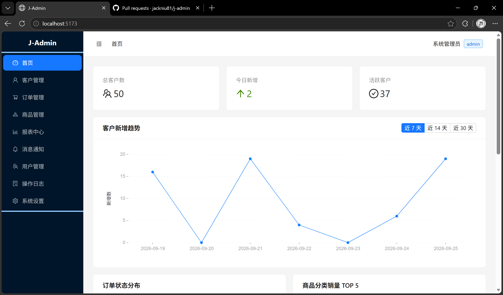
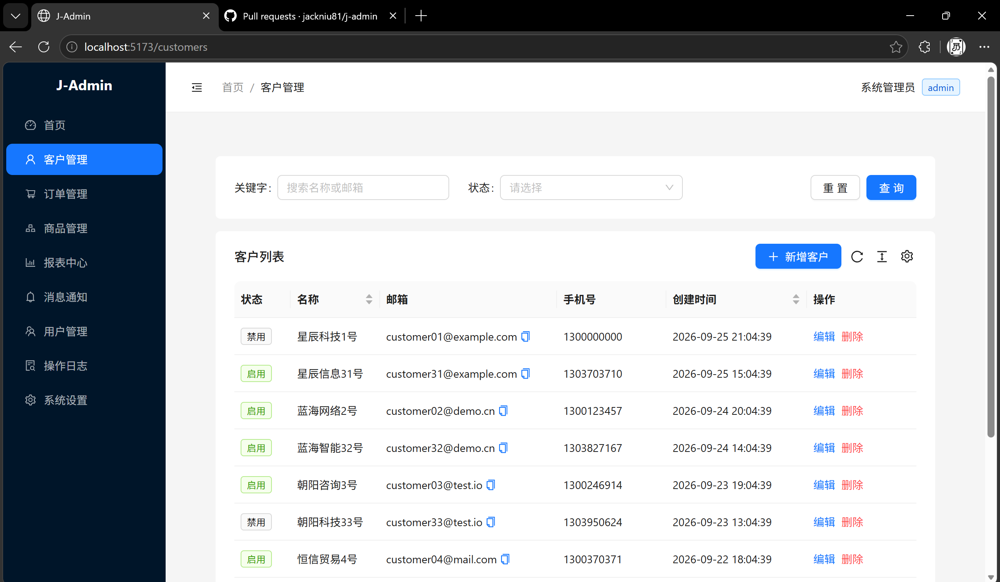
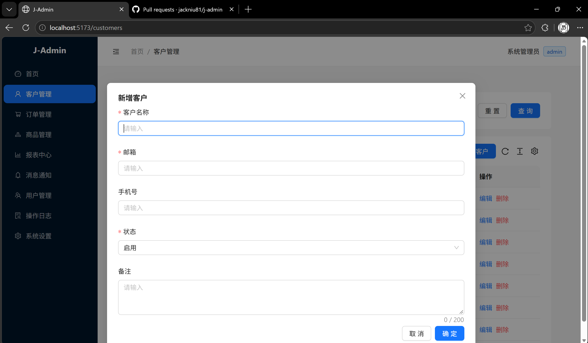
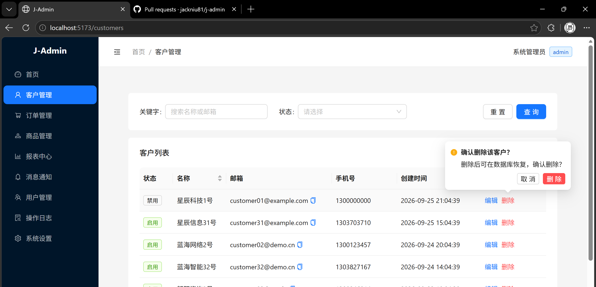
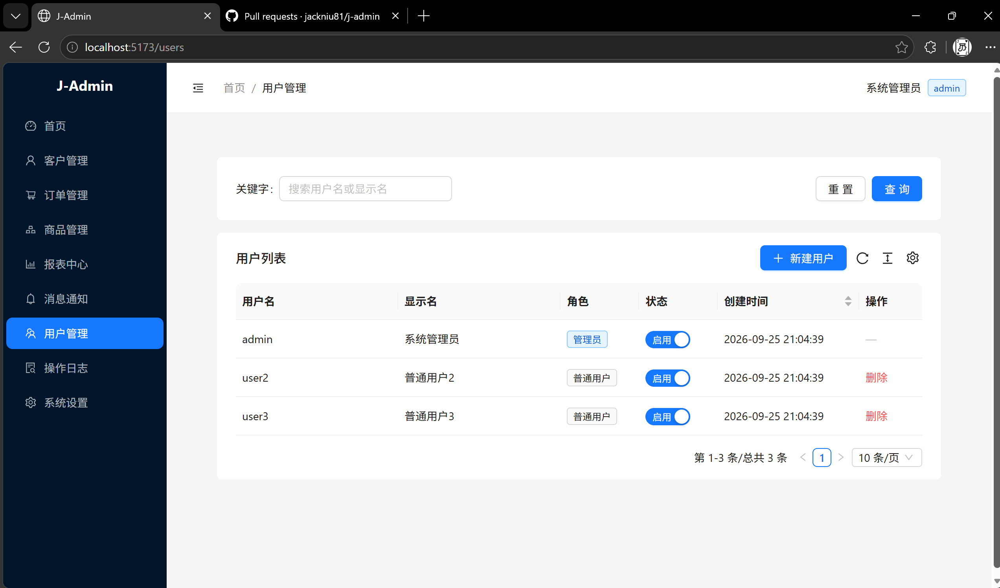
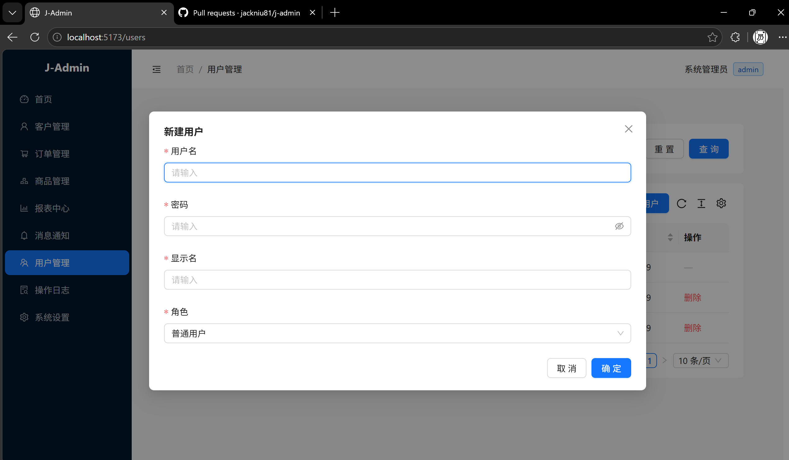
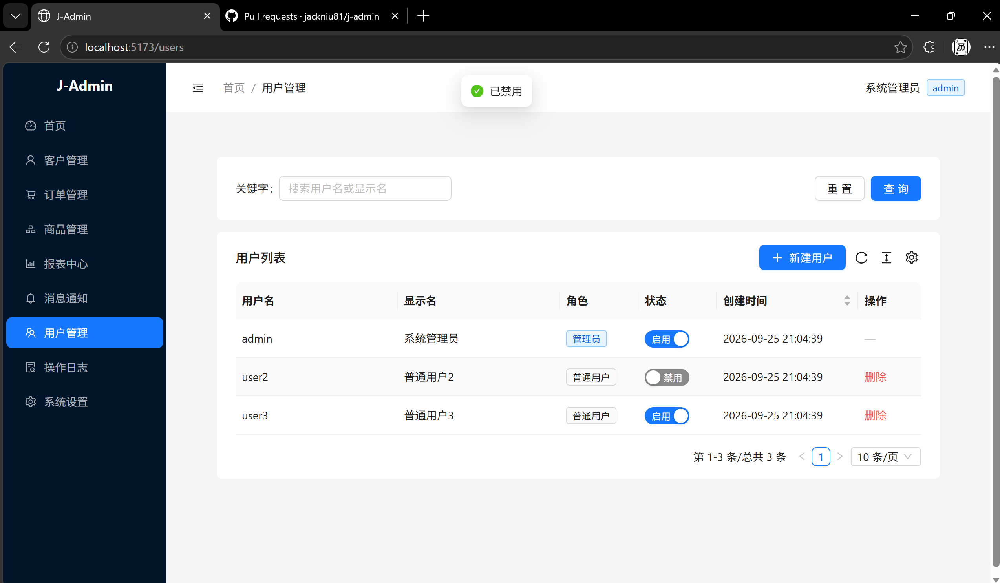

# J-Admin 使用手册

本手册按界面逐项介绍 J-Admin 当前已实现与规划中的功能，配合截图说明。项目整体定位与技术栈见 [README](../README.md)，接口与数据契约细节见 [spec.md](./spec.md)。

## 快速开始

```bash
npm install
npm run seed -w server   # 重置演示数据（文件数据库模式）
npm run dev              # 同时启动后端(3000) + 前端(5173)
```

浏览器打开 http://localhost:5173/ ，使用演示账号登录：

| 账号 | 密码 | 角色 | 说明 |
| --- | --- | --- | --- |
| `admin` | `admin` | 管理员 | 可访问全部菜单，含用户管理 |
| `user2` | `user2` | 普通用户 | 无「用户管理 / 操作日志 / 系统设置」 |
| `user3` | `user3` | 普通用户 | 同上 |

> 后端支持文件数据库（默认，免安装）与 PostgreSQL 双数据源，通过 `DB_DRIVER` 配置切换，详见 spec.md。

## 角色权限矩阵

| 功能 | admin | user |
| --- | :---: | :---: |
| 首页 Dashboard | ✅ | ✅ |
| 客户管理：查询 / 新增 / 编辑 | ✅ | ✅ |
| 客户管理：删除 | ✅ | ❌（前端隐藏 + 后端 403） |
| 用户管理（列表 / 新建 / 启用禁用 / 删除） | ✅ | ❌ |
| 操作日志 / 系统设置 | ✅（占位） | ❌ |

前端按角色过滤菜单并做 403 兜底，后端 Guard 二次校验，双保险。

## 功能与界面

### 登录

账号密码登录，JWT 鉴权；未登录访问后台页会被路由守卫重定向到登录页，token 过期自动跳转并提示。登录失败展示统一错误文案。

### 首页 Dashboard

登录后默认进入首页，顶部为三张统计卡片：**总客户数 / 今日新增 / 活跃客户**（来自后端真实统计接口）。



往下是**客户新增趋势**折线图（近 7 / 14 / 30 天切换）；以及两张对应「订单 / 商品」模块的可视化占位图——**订单状态分布**环形饼图与**商品分类销量 TOP 5**柱状图（当前为演示数据），最底部为**客户状态分布**柱状图。


### 客户管理

标准数据表格页，支持：关键字搜索（名称 / 邮箱）、按状态筛选、按名称 / 创建时间排序、分页。每行提供编辑与删除操作。



**新增 / 编辑客户**：弹窗表单，字段含客户名称、邮箱、手机号、状态、备注，前后端一致校验（必填、邮箱格式、手机号 11 位、备注 ≤ 200 字）。



**删除客户**：二次确认，采用软删除（标记 `deleted`，数据可在库中恢复）。非管理员不显示删除入口。



### 用户管理（仅管理员）

用户列表展示用户名、显示名、角色、状态开关、创建时间；当前登录者所在行的操作列显示「—」（不能删自己）。



**新建用户**：弹窗填写用户名、密码、显示名、角色；用户名唯一，重复返回「用户名已存在」。



**启用 / 禁用**：状态列开关即时切换并弹出全局提示；不允许禁用自己或最后一个管理员。



### 规划中的模块（占位页）

以下菜单已在侧边栏占位，点击进入「功能开发中」页，尚未实现具体业务：

| 菜单 | 角色 | 计划能力 |
| --- | :---: | --- |
| 订单管理 | 全部 | 订单列表、状态流转、详情 |
| 商品管理 | 全部 | 商品 CRUD、分类、库存 |
| 报表中心 | 全部 | 多维统计与导出 |
| 消息通知 | 全部 | 站内消息、已读/未读 |
| 操作日志 | admin | 关键操作审计查询 |
| 系统设置 | admin | 参数配置、字典管理 |

## 相关文档

- [README](../README.md) —— 项目总览、技术栈、功能清单
- [spec.md](./spec.md) —— 功能规格、双数据源方案、API 契约、权限矩阵
